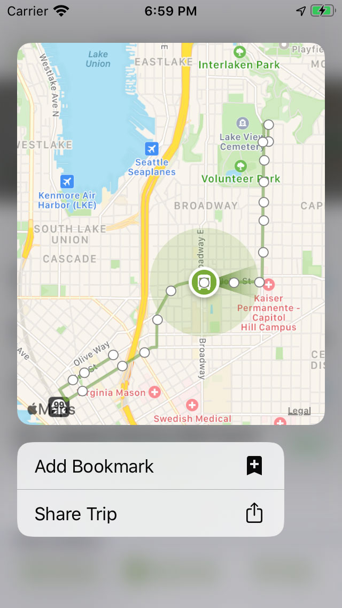

# Adding a Context Menu to a Collection Cell

This guide is about implementing an iOS 13 `UIContextMenu`, which replaced 3D Touch/Force Touch.

## Helpful Resources

* Kyle Bashour, a software engineer, [wrote a very helpful guide about how this feature works](https://kylebashour.com/posts/context-menu-guide). I found Kyle's guide to be invaluable to my understanding of the feature. This guide, in contrast, is strictly about OBA's implementation of `UIContextMenu`s.
* [Apple's documentation about this feature](https://developer.apple.com/documentation/uikit/menus_and_shortcuts) may be helpful as well.
* WWDC 2019 Session 224, [Modernizing Your UI for iOS 13](https://developer.apple.com/videos/play/wwdc2019/224/) also has information on this feature.

## Dependence on CollectionController

This feature only works as described if your user interface is hosted within an instance of `CollectionController`.

## IGListKit Components

Mark your `OBAListSectionController` subclass as conforming to the `ContextMenuProvider` protocol:

    final class MySectionController: OBAListSectionController<MyViewModel>, ContextMenuProvider { }
    
and then implement the `contextMenuConfiguration(forItemAt:)` method:

    func contextMenuConfiguration(forItemAt indexPath: IndexPath) -> UIContextMenuConfiguration? {
        // TODO!
    }

Potientally add one or more blocks to your `ListDiffable`-implementing class (i.e. the view model) for a `UIViewController` preview and for each `UIMenu`action that you will support in the `UIContextMenu`.

If your previewed view controller implements the `Previewable` protocol, then you should be calling its `enterPreviewMode()` method here while constructing `UIContextMenuConfiguration`'s `previewProvider` parameter.

Here's a complete example of creating a `UIContextMenuConfiguration` object within `contextMenuConfiguration(forItemAt:)`:

        return UIContextMenuConfiguration(identifier: nil, previewProvider: {
            guard let controller = tableRow.previewDestination?() else { return nil }
            if let previewable = controller as? Previewable {
                previewable.enterPreviewMode()
            }
            return controller
        }, actionProvider: { _ -> UIMenu? in
            if let menu = tableRow.buildContextMenu?() as? UIMenu {
                return menu
            }
            else {
                return nil
            }
        })

## Hosting View Controller

A `UIContextMenu` is presented from a view controller. This view controller, referred to here as the hosting view controller, is responsible for:

* Attaching blocks to your view models, which will trigger actions. (e.g. an 'Add Bookmark' context menu item would trigger the presentation of the `AddBookmarkViewController` from the hosting view controller.)
* From your `UIViewController` preview block (attached to the view model), the hosting view controller should include code to toggle the previewed view controller into preview mode.

## Previewed View Controller

This view controller should conform to the `Previewable` protocol and implement its required methods.

* `enterPreviewMode()` - configure your view controller UI to be in a 'bare bones' preview state. Show a small, glanceable UI here.
* `exitPreviewMode()` - configure your view controller UI to be presented in a full screen normal mode. Unhide all of the UI you disabled in `enterPreviewMode().`