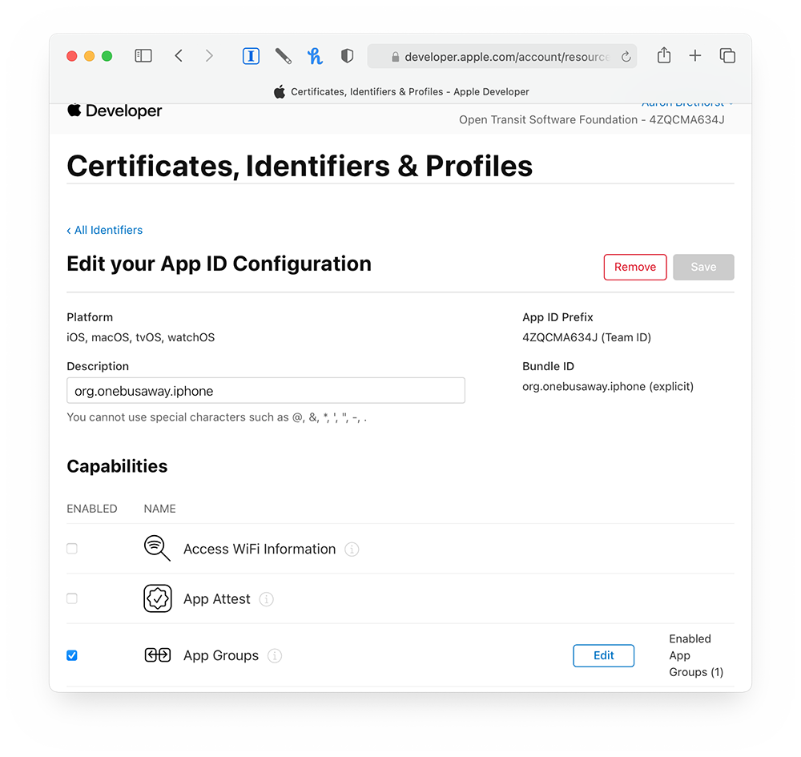
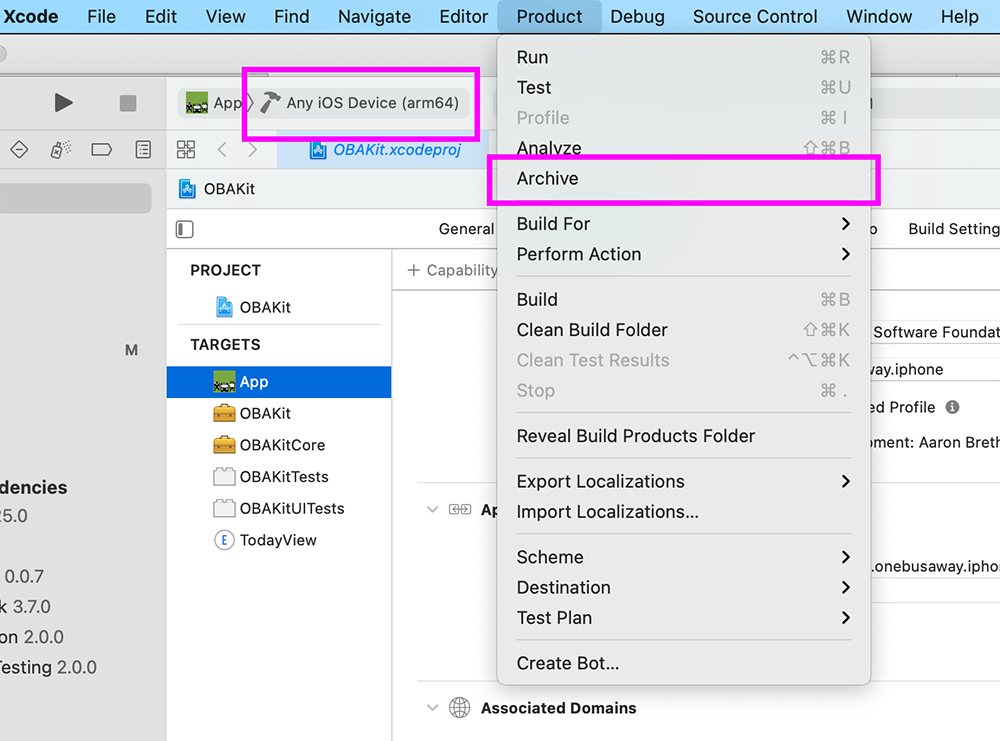

# White Labeling and Embeddable Frameworks

## What is OBAKit

[OBAKit](https://www.github.com/onebusaway/obakit) is a total rewrite of OneBusAway for iOS. It is built in Apple's modern Swift programming language, and is designed to allow transit agencies to easily build and ship their own custom branded versions of OneBusAway for iOS or embed OneBusAway features into their existing iOS apps.

## Background and Motivation

When OneBusAway was first released in the early 2010s, it was designed to work exclusively in the Puget Sound, Washington region with the OneBusAway branding. Later, OneBusAway for iOS was updated with 'multi-region' support, but—quite reasonably—some transit agencies prefer to offer a transit information app that bears their own brand (e.g. YRTViva).

It has always been feasible for transit agencies to rebrand the OneBusAway iOS app with their own custom name, icon, and color scheme, but this has required "forking" the OneBusAway codebase, which means that transit agencies lose the ability to take advantage of bug fixes and features crafted by OneBusAway for iOS's volunteer software developers.

Meanwhile, transit agencies who already offer apps were simply unable to take advantage of OneBusAway's features, and are required to recreate or forego features like stop and trip mapping.

OBAKit is designed from the ground-up to address both of these challenges with two new features: White Labeling and Embeddable Frameworks.

## White Labeling

White Label support means that a transit agency can apply their own brand—name, icon, and color scheme—to the OneBusAway app, and ship the application as their own in the App Store without losing access to new features and bug fixes in OBAKit. New apps can easily be created in well under one day.

Before you begin!

* Make sure you follow the instructions in the README such that you can successfully build OneBusAway.
* Close the OBAKit.xcodeproj file in Xcode (if you have it open).

To create your own white label app (let's call it "MyApp"):

### 1. Create Project Directory

First, duplicate the `Apps/OneBusAway` directory and rename it as you see fit. In this case, we'll make a copy at `Apps/MyApp`. For example, some of our current White Label apps are called "KiedyBus" and "YRTViva".

### 2. Update Files

Second, update the files that are explicitly tied to OneBusAway with your own custom changes:

* App Icon
* AppDelegate.m
* project.yml
* GoogleService-Info.plist (if you want to use Firebase and Crashlytics)
* regions.json

(List is known to be incomplete. Pull requests welcome.)

Most of the changes you will need to make should be in the files `AppDelegate.m` and `project.yml`.

### 3. Generate Your App

Third, once you are satisfied with your initial changes, run the command `scripts/generate_project MyApp` from the root of the project. This will generate a new `OBAKit.xcodeproj` project that contains MyApp's custom design.

### 4. Build, Run, and Test

Fourth, build, run, and test MyApp.

### 3rd Party Service Dependencies

Some features that are present within OneBusAway will require you to create and maintain accounts with third party services. For instance, OneBusAway uses the following services:

* Google Firebase for crash reporting and analytics.
* OneSignal for push notifications.
* OneBusAway.co (Obaco) for alarms.

(List accurate as of May 15, 2021.)

If you do not wish to use these services in your app, you may disable them by excluding the relevant pieces of data in your `AppDelegate.m` and `project.yml` files. Furthermore, both analytics and push notifications are designed to support integration of other third party services. Please contact the OBAKit project maintainer for more information on how you can add support for other third party services.

## Embeddable Frameworks

The new OneBusAway for iOS app is built on top of two frameworks as part of a project called OBAKit. These frameworks, OBAKitCore and OBAKit, provide all of the OneBusAway application's functionality, and they are designed to be reused in other applications.

### OBAKitCore.framework

This is a lower-level framework whose primary function is to provide networking and data modeling services. It is a dependency of `OBAKit.framework`.

Example use cases:

* I want to access OneBusAway data from an AWS Lambda service.
* I want to build a new OneBusAway UI for macOS or watchOS.
* I want to build a custom user interface for displaying OneBusAway data within my iOS app.

### OBAKit.framework

This is a higher-level framework that contains almost all of the OneBusAway application UI. It depends on `OBAKitCore.framework`.

Example use cases:

* I want to embed OneBusAway application screens, like stops or trip information, into my existing app.

## Apple Developer Accounts and Settings

### Sign up 

Building your app for submission to Apple will require you to have a [Apple Developer account](https://developer.apple.com/programs/).

### Log in to your Apple Developer account in Xcode

In Xcode, navigate to the Xcode menu > Preferences > Accounts

Log in to your Apple Developer account

### Create identifier

Once you have an Apple Developer account, you will need to create an identifier for your app. (if you already have an identifier, then skip this step!)

### Configure identifier

Once your identifier has been created, configure it with the following settings:

* App Groups - This is used to let the Today View widget share data with the main app
* Associated Domains - Used to allow OneBusAway.co to work with OBAKit apps. This is necessary for apps that support alarms.
* Push Notifications - Only if you want to support alarms. Currently, only the free [OneSignal service](https://onesignal.com) is supported within OBAKit.

### Verify in Xcode

If your app has been correctly configured, you should see a Signing &amp; Capabilities screen in Xcode that looks similar to what is depicted below. Namely, the "Team", "Provisioning Profile", and "Signing Certificate" fields are populated, an App Group is listed, Associated Domains are populated with "applinks", the "Remote notifications" Background Mode is checked, and the "Push Notifications" capability is included in the app.

### Run your app in the Simulator

Launch your app in the Simulator and make sure everything looks correct.

### Archive Your App

Once you are satisfied, create an Archive of your app by changing your build option to "Any iOS Device (arm64)", and selecting the Product > Archive menu item.

Then, you can submit your app to Apple for distribution via TestFlight and the App Store.

