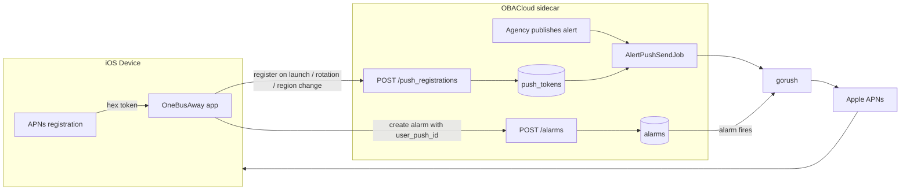

# Push Notifications in OneBusAway

This document explains how push notifications work across the OneBusAway stack — what the server offers, what the iOS app implements, and what you need to do to integrate a mobile app (an OBAKit white-label app or an entirely separate client) with OBACloud push notifications.

**Audience:** mobile developers integrating with OBACloud push, and contributors working on OBAKit's push code.

---

## 1. The big picture

There are four push-driven features, all served by the same OBACloud (a.k.a. "Obaco" sidecar) server and the same APNs device token:

| Feature | Who triggers the push | How the server learns the token | Notification shape |
|---|---|---|---|
| **Trip alarms** | The rider ("notify me 10 minutes before my bus arrives") | Attached to the alarm at creation (`user_push_id`) | Alert + custom `arrival_and_departure` payload |
| **Live Activities** | Server-pushed updates to a Lock Screen activity | Attached to the activity at creation (`push_token`) | ActivityKit content updates (not a user-visible alert) |
| **Service alerts** | A transit agency publishing an alert with a notification | Proactive device registration (`push_registrations`) | Plain alert: `title` + `body` only |
| **Donation prompts** | Server campaign | Same token as alarms | Alert + `donation` payload |



*(Diagram shows the trip-alarm and service-alert flows; Live Activities and donation prompts ride the same gorush → APNs path.)*

Key facts that shape everything below:

- **The token is the identity.** There are no accounts. Ownership of a registration or alarm is possession of the APNs token (or the alarm's URL). All endpoints are unauthenticated; `push_registrations` is additionally rate-limited to **30 requests/minute/IP** (alarms and Live Activities have no throttle today).
- **Everything is region-scoped.** Each OBA region may run its own sidecar (`Region.sidecarBaseURL`). All paths embed the numeric region identifier. If the current region has no sidecar URL, push features are unavailable there.
- **Tokens go stale.** The server prunes tokens whose `last_seen_at` is over 180 days old (a daily job), and APNs bounce feedback removes dead tokens. Clients keep themselves alive by re-registering periodically (see §3).

---

## 2. Server API contracts

Base URL is the region's sidecar URL (e.g. `https://onebusaway.co`). All requests are `application/x-www-form-urlencoded`. Standard query params (`key`, `app_uid`, `app_ver`, `version=2`) are appended by OBAKit automatically; other clients should send an API key the same way.

### 2.1 Device registration — service alerts audience

**Register / refresh (upsert on `(region, token)` — create and update are the same call):**

```
POST /api/v2/regions/{region_id}/push_registrations
```

| param | presence | value |
|---|---|---|
| `token` | server-enforced (`422` if missing) | APNs device token, lowercase hex (see §4.1) |
| `operating_system` | server-enforced (`422` if invalid) | `"ios"` (literal; `"android"` also accepted server-side) |
| `locale` | always send (no server validation — omitting silently buckets the device into English) | Device BCP-47 identifier, e.g. `es-MX`, `zh-Hant-TW` — send exactly what the OS reports, do **not** normalize |
| `test_device` | always send (omitting silently resets the stored value to `false` on upsert) | `true`/`false` — **send on every call.** The upsert overwrites the stored value |
| `description` | server-enforced **when `test_device=true`** (`422` if blank) | Free text ≤255 chars identifying the device to admins, e.g. `"Aaron's iPhone 17"`. The server clears it automatically when a device is demoted to `test_device=false` |

Responses: `204 No Content` on success; `422` `{error, messages}` on validation failure; `404` unknown region; `429` throttled.

> The `description` requirement landed server-side on 2026-07-19; the iOS client sends it from the **Test Device Name** field in Settings → Debug, and registers as a regular device (`test_device=false`) until that field is filled in.

```bash
curl -X POST "https://onebusaway.co/api/v2/regions/1/push_registrations?key=org.example.app" \
  -d token=01abff007fdeadbeef... \
  -d operating_system=ios \
  -d locale=es-MX \
  -d test_device=false
```

**Locale mapping** happens server-side: exact match → known aliases (`zh-CN` → `zh-Hans`) → primary subtag (`es-MX` → `es`) → English for anything unrecognized. Your job is only to report the locale faithfully; the server picks the alert translation.

**Unregister:**

```
DELETE /api/v2/regions/{region_id}/push_registrations?token={token}
```

`204` on success, `404` if the token was never registered (safe to treat as success — catch that case specifically rather than swallowing all errors). Call this if your app offers an in-app opt-out. OS-level permission revocation does *not* require a DELETE — APNs bounces clean the token up server-side.

### 2.2 Trip alarms

```
POST /api/v2/regions/{region_id}/alarms
```

| param | value |
|---|---|
| `seconds_before` | seconds before arrival/departure to fire |
| `stop_id`, `trip_id`, `stop_sequence` | identify the arrival-departure |
| `service_date` | epoch **milliseconds** (Int64) |
| `vehicle_id` | optional |
| `user_push_id` | the APNs hex token |
| `operating_system` | `"ios"` |
| `apns_sandbox` | send `1` from debug-provisioned builds (see §6) |

Response is JSON containing the alarm's own URL, which is also how you cancel it:

```json
{"url": "https://alerts.example.com/regions/1/alarms/1234567890"}
```

Creation answers `201 Created` with that JSON body.

```
DELETE {alarm.url}   →  204 (or legacy empty 200) on success, 404 if already gone
```

### 2.3 Live Activities

```
POST /api/v2/regions/{region_id}/live_activities
```

Registers an ActivityKit push token (`push_token`, plus `apns_sandbox` under debug) and returns a subscription URL; `DELETE` that URL to stop updates. See `ObacoAPIService.postLiveActivity`/`deleteLiveActivity` and `LiveActivityRegistry` for the full contract — the lifecycle mirrors alarms (server returns a URL; you delete it).

---

## 3. When to register (the contract every client must honor)

Service-alert reach depends entirely on clients registering proactively. A conforming client registers:

1. **On every app launch/foreground where notification permission is granted** — this refreshes the server's `last_seen_at` and is what keeps the token alive past the 180-day prune. Provisional and ephemeral authorization count as granted: those users receive (quiet) notifications and are exactly the audience the API exists to count.
2. **Whenever APNs delivers a token** — tokens rotate on restore/reinstall. Register the new token; the old row simply ages out.
3. **On region change** — register against the new region. (Optionally DELETE from the old one; otherwise the old row lingers until the prune, meaning a rider who moves can receive the old region's alerts for a while.)

**Be polite about it.** Naively POSTing on every trigger works but wastes battery and flirts with the rate limit. The iOS implementation dedupes: it persists the last successful registration `(token, region, locale, test_device, timestamp)` and only re-POSTs when one of those inputs changes or the last POST is older than 24 hours. Failed POSTs must *not* be recorded as successes — retry on the next trigger.

---

## 4. iOS implementation (OBAKit)

### 4.1 Component map

```
AppDelegate (per-app, Objective-C)
  │  forwards didRegisterForRemoteNotificationsWithDeviceToken / didFail…
  ▼
OBACloudPushService (OBAKit/PushNotifications/OBACloudPushService.swift)
  │  PushServiceProvider impl: requests authorization, hex-encodes the token,
  │  UNUserNotificationCenterDelegate (foreground banners, tap routing)
  ▼
PushService (OBAKit/PushNotifications/PushService.swift)
  │  wraps any PushServiceProvider; parses payloads; forwards to delegate
  ▼
Application (OBAKit/Orchestration/Application.swift)
  │  PushServiceDelegate: navigates on alarm taps, feeds tokens to ↓
  ▼
PushRegistrationManager (OBAKit/PushNotifications/PushRegistrationManager.swift)
  │  policy: auth gating, dedupe + 24h refresh, coalescing, stale-region guard
  ▼
ObacoAPIService (OBAKitCore/Network/ObacoAPIService.swift)
     the actual HTTP calls (postPushRegistration / postAlarm / …)
```

The token is hex-encoded exactly once, in `OBACloudPushService`:

```swift
let token = tokenData.map { String(format: "%02.2hhx", $0) }.joined()
// e.g. "01abff007f…" — lowercase hex, no separators
```

### 4.2 Registration lifecycle in practice

Three triggers feed `PushRegistrationManager`; all of them are safe to fire redundantly because the manager dedupes and coalesces:

```swift
// 1. Every foreground (Application.applicationDidBecomeActive):
if pushService != nil {                     // nil on Simulator / providerless apps
    Task { await pushRegistrationManager.refreshRegistration() }
}
// refreshRegistration(): if authorized → registerForRemoteNotifications()
// (APNs re-delivers the token, rotated or not) → registerIfNeeded()

// 2. Every token delivery (PushServiceDelegate):
public func pushService(_ pushService: PushService, receivedDeviceToken token: String) {
    pushRegistrationManager.updateDeviceToken(token)
    Task { await pushRegistrationManager.registerIfNeeded() }
}

// 3. Region change (regionsService(_:updatedRegion:)) — obacoService has
// already been rebuilt for the new region by the time this fires:
Task { await pushRegistrationManager.registerIfNeeded() }
```

`registerIfNeeded()` is the single choke point. It no-ops unless there is a token, an Obaco service *matching the current region*, and notification permission; it skips the POST when nothing changed and the last POST is under 24h old; and concurrent calls (foreground trigger racing the token callback on first permission grant) coalesce into a single POST. Server rejections are reported through the app's configured `Analytics.reportError` implementation (Crashlytics in the OneBusAway app) via an injected `errorReporter` — registrations are the server's only audience source, so fleet-wide failures must be observable. Note that `reportError` is an optional protocol method: white-label apps using only Plausible/Umami analytics don't implement it, and currently have no remote visibility into registration failures.

Two subtleties worth knowing before you touch this code:

- **Stale-region guard:** switching to a region *without* a sidecar leaves the previous region's `obacoService` in place (`CoreApplication.refreshObacoService()` early-returns). The manager compares `obacoService.regionID` against the current region and refuses to register against a region the user left.
- **`test_device` gating:** debug builds and Debug-Mode-enabled release builds only register as test devices once a **Test Device Name** is set in Settings → Debug; without one, they downgrade to a regular registration (`test_device=false`, no `description` sent) rather than POST a guaranteed 422. Agencies use the "Test users only" audience to preview an alert push before sending it to everyone. The same name also gates the **Display test alerts** switch (Settings → Debug): regional test alerts are only fetched and shown once the switch is on *and* a name is set (`AgencyAlertsStore.shouldDisplayTestAlerts`).

### 4.3 Receiving notifications

`OBACloudPushService` presents foreground notifications as `[.banner, .sound]`. On tap, the payload's `userInfo` routes through `PushService`:

**Trip alarm** — `userInfo` contains a single `arrival_and_departure` key:

```json
{
  "aps": { "alert": { "body": "Your bus arrives in 10 minutes" } },
  "arrival_and_departure": {
    "trip_id": "1_604670535",
    "stop_id": "1_75403",
    "region_id": 1,
    "vehicle_id": "1_4361",
    "service_date": 1752624000000,
    "stop_sequence": 3
  }
}
```

This decodes into `AlarmPushBody` (note `service_date` is epoch **milliseconds**) and the app navigates to the stop, deleting the fired alarm locally.

> ⚠️ **Known issue in the routing guard:** `PushService.notificationReceivedHandler` only routes to the alarm/donation cases when `userInfo` contains **exactly one** key — but for a real remote notification, `UNNotificationContent.userInfo` contains the entire payload, i.e. `aps` *plus* the custom key. With the direct-APNs provider forwarding `userInfo` unfiltered, real alarm/donation taps fail that single-key check and fall through to the generic in-app dialog instead of navigating. (The existing unit tests exercise payloads without `aps`, which is why they pass.) The guard predates the OneSignal removal — OneSignal delivered custom data pre-stripped — and needs to become "exactly one key *besides* `aps`".

**Donation prompt** — `{"donation": "<experiment-id>"}` → the app shows the donation UI.

**Service alert** — plain `title` + `body`, no custom keys. No special handling is required to display it; on tap, `PushService`'s fallback re-presents the message body in an in-app dialog. Deep-linking to the alert detail would require a server-side payload addition first (possible follow-up, not yet specced).

**Rule for new payload types:** the server sends exactly one *custom* key alongside `aps`; `PushService.notificationReceivedHandler` switches on it. Add a new key → add a new case + `PushServiceDelegate` method (and mind the guard caveat above).

---

## 5. Integrating a new app

### 5.1 White-label OBAKit app

Everything in §4 is already wired. You need to:

1. **Provide APNs capability** — add the Push Notifications entitlement and an APNs key/cert for your bundle ID in your Apple Developer account; the OBACloud operator configures the matching credentials in gorush.
2. **Create the provider and forward the delegate callbacks** in your `AppDelegate`:

```objc
// AppDelegate.m (see Apps/OneBusAway/AppDelegate.m for the full version)
- (instancetype)init {
    // …
    _pushService = [[OBACloudPushService alloc] init];
    appConfig.pushServiceProvider = _pushService;
}

- (void)application:(UIApplication *)application
        didRegisterForRemoteNotificationsWithDeviceToken:(NSData *)deviceToken {
    [self.pushService didRegisterForRemoteNotificationsWithDeviceToken:deviceToken];
}

- (void)application:(UIApplication *)application
        didFailToRegisterForRemoteNotificationsWithError:(NSError *)error {
    [self.pushService didFailToRegisterForRemoteNotificationsWithError:error];
}
```

If `AppConfig.pushServiceProvider` is nil (as in KiedyBus today), the entire push stack is dormant and every code path no-ops safely — you don't have to do anything to *not* support push.

3. **Ensure your region has a sidecar** — push features require `Region.sidecarBaseURL`.

A custom `PushServiceProvider` (e.g. wrapping a third-party push SDK) must satisfy the protocol in `PushService.swift`; the non-obvious requirement is invoking `deviceTokenUpdatedHandler` on **every** token delivery, including rotations — that callback is what keeps rotated tokens registered.

### 5.2 Non-OBAKit client (Android, forks, etc.)

Implement the server contract directly:

1. Obtain the platform push token; hex-encode APNs tokens (FCM tokens are sent as-is with `operating_system=android`).
2. Implement the three registration triggers from §3, with dedupe (persist your last successful `(token, region, locale, test_device)` + timestamp; re-POST on change or after ~24h).
3. Always send `test_device` explicitly. Always send the unnormalized BCP-47 locale.
4. Send `description` whenever registering with `test_device=true` — the server rejects (`422`) a test-device registration with a blank or missing `description`. If you have no name to send, register with `test_device=false` instead of guaranteeing a failure.
5. Treat `204` as success, `422` as a bug to surface to your crash reporter, `429` as "back off, your dedupe is broken," and DELETE `404` as success.
6. For trip alarms, store the returned alarm `url` — it is the only handle for cancellation.

---

## 6. Testing and the APNs sandbox

- **Simulators get no real APNs tokens.** OBAKit skips push configuration entirely under `#if targetEnvironment(simulator)`. Test registration logic with unit tests (see `PushRegistrationManagerTests` — the dedupe, coalescing, and auth-gating behaviors are all covered with injected closures and a mock data loader; no network or notification center needed).
- **Debug builds hold *sandbox* tokens.** A debug-provisioned install registers with the APNs sandbox host; pushes sent through production APNs bounce off it. Alarms and Live Activities handle this by sending `apns_sandbox=1` from debug builds, which the server forwards to gorush as `development: true`.
- **Setting up a test device:** since 2026-07-19 the server rejects `test_device=true` registrations without a non-blank `description` (`422`). To register this install as a test device: enable **Debug Mode** in Settings → Debug, fill in **Test Device Name** (e.g. "Aaron's iPhone 17"), then re-foreground the app so `PushRegistrationManager` picks up the change and re-POSTs. Until the name is set, the device silently registers as a regular device (`test_device=false`) instead of failing.
- **⚠️ Known gap — sandbox routing for service alerts:** the `push_registrations` API has no `apns_sandbox` param and the alert fan-out always uses production APNs — so even once registered, a *debug* build **cannot receive** the preview push. Until [OneBusAway/obacloud#983](https://github.com/OneBusAway/obacloud/issues/983) lands, verify alert delivery with a **TestFlight** build (production token) flagged via the Debug Mode switch.
- **End-to-end check:** register a device with `test_device=true`, have an OBACloud admin publish an alert with the "Test users only" audience, and confirm only flagged devices receive it.

---

## 7. Operational notes

- **Rate limit:** 30 requests/minute/IP on `push_registrations` (the other push endpoints are unthrottled today). The iOS dedupe keeps a healthy device to roughly one registration POST per day.
- **Prune:** tokens unseen for exactly 180 days are dropped by a daily job; APNs "unregistered" bounces are cleaned continuously. Reach decays silently if clients stop refreshing — watch registration volume server-side after releases.
- **Failure visibility:** client-side registration failures are logged (`Logger`) and server rejections (`APIError.requestFailure`) are reported to the analytics error channel. A fleet-wide flat-line in registrations is the signal that something systematic broke.
- **Privacy:** the server stores `(token, region, operating_system, locale, test_device, timestamps)` plus — for test devices only — a free-text `description` identifying the device to admins (e.g. `"Aaron's iPhone 17"`; cleared automatically when the device stops being a test device). There is no account linkage for regular riders. The token is useless to third parties without the app's APNs credentials.

## 8. Source map

| What | Where |
|---|---|
| Provider protocol, payload routing | `OBAKit/PushNotifications/PushService.swift` |
| Direct-APNs provider, token hex-encoding, UN delegate | `OBAKit/PushNotifications/OBACloudPushService.swift` |
| Registration policy (dedupe/coalescing/gating) | `OBAKit/PushNotifications/PushRegistrationManager.swift` |
| HTTP calls to the sidecar | `OBAKitCore/Network/ObacoAPIService.swift` |
| Alarm creation UX | `OBAKit/PushNotifications/AlarmBuilder.swift` |
| Alarm push payload model | `OBAKit/PushNotifications/AlarmPushBody.swift` |
| App wiring, lifecycle triggers, delegate impls | `OBAKit/Orchestration/Application.swift` |
| Reference AppDelegate forwarding | `Apps/OneBusAway/AppDelegate.m` |
| Tests worth reading first | `OBAKitTests/PushNotifications/PushRegistrationManagerTests.swift`, `OBAKitTests/Modeling/Obaco Model Service Tests/PushRegistrationModelOperationTests.swift` |
